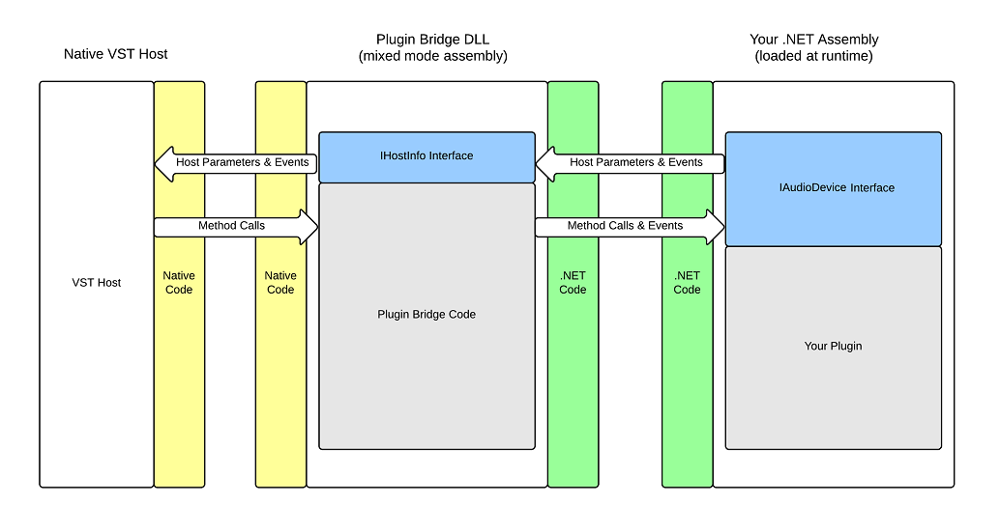

# Introduction

SharpSoundDevice is a library that allows you to develop VST-compatible plugins (or "devices") using .NET. 

A plugin developer can reference the SharpSoundDevice.dll assembly, develop a plugin that implmenents the IAudioDevice interface and load it in any VST 2.4 -compatible host, without having to touch any native code.

# Features

* Quickly build audio plugins using C# (or another .NET language).
* Provides a nice abstraction layer over the (old and dated) VST API.
* Allows you to use WinForms or WPF to develop user interfaces.
* Open source, MIT Licensed.

# Functional Overview

1. A plugin developer writes and compiles a .NET assembly (dll file) that contains a public class implementing IAudioDevice.
2. A "Plugin Bridge" DLL is generated using the BridgeGenerator tool (included in the release archive)
	* The bridge is the actual VST plugin. It exports the VSTPluginMain method that is called by the host.
	* The BridgeGenerator works by taking a template DLL file and replacing a placeholder string inside it with the name of your plugin. It then writes a copy of that DLL that is configured specially for your plugin.
3. The host loads the plugin bridge as a VST plugin.
4. The plugin bridge in turn loads the .NET assembly.
5. When the host calls methods in the VST plugin, the bridge translates those arguments into .NET parameters and forwards them to the .NET plugin. It acts as a translation layer between the native code host and the .NET plugin.
6. When the .NET plugin needs information about the host, or wants to send MIDI events, the bridge converts those parameters into native datatypes.

# Quickstart

The quickstart contains 2 demo plugins and covers the development process.

[View the quickstart guide](/Quickstart.md)

# Download

Stable versions are provided as compiled 32 and 64 bit Windows binaries.

[Get the latest version from the Github repository.](../../tree/master/Builds)

The binaries are build against MSVC 1.4.1 (Microsoft Visual C Runtime). You can download the Redistributable directly from Microsoft:

* [Microsoft Web Page (scroll to bottom of page)](https://www.visualstudio.com/downloads/)
* [x64 Direct Link](https://aka.ms/vs/15/release/VC_redist.x64.exe)
* [x86 Direct Link](https://aka.ms/vs/15/release/VC_redist.x86.exe)

# License

SharpSoundDevice is licensed under the MIT license.

[View the license.](/license.txt)

# Example Plugins

First, look at the Quickstart. Once you get through that, have a look at [my plugin repository](https://github.com/ValdemarOrn/SharpSoundPlugins)

# Documentation

Documentation is still limited, but (almost) all public entities in the SharpSoundDevice library have code comments that should answer most questions.

[Documented source code for SharpSoundDevice Assembly](../../tree/master/SharpSoundDevice)

## Current Limitations

* **Currently the plugin bridge only supports one IAudioDevice per assembly!** That means, if you create more than one class inside your .NET assembly that implements this interface, it might not be able to load it. This is a limitation that may (or may not :) be changed in the future. Until then, **strictly one device per assembly, please!**
* Windows only. Linux support is a possibility by using Mono, but requires writing a new bridge adapter.
* Bad things will happen if you attempt to load multiple plugins that use different versions of the SharpSoundDevice Library. Don't.

## To Build

You don't need to build the library from source in order to develop plugins. You can download the latest stable version [from here](../../tree/master/Builds)

If you want to compile your own version you will need VST 2.4 SDK to compile from source. The SDK is *not* open source and must be downloaded [directly from Steinberg](https://www.steinberg.net/en/company/developers.html). However, compiled version of the libraries can be freely distributed in compliance with the license. Download the VST3 Plug-in SDK from Steinberg, this also includes the legacy (but still widely used) 2.4 framework.

Place the **VST2_SDK** directory in the root of the repository, so you have a tree like this:

	- .gitignore
	- Build.bat
	- Readme.md
	- license.txt
 	- ...more files...
	- VST2_SDK/
		- pluginterfaces/
			- vst2.x/
				- aeffect.h
				- aeffectx.h
				- vstfxstore.h
		- public.sdk/
			- source/
				- vst2.x/
					- aeffeditor.h
					- audioeffect.cpp
					- audioeffect.h
					- audioeffectx.cpp
					- audioeffectx.h
					- vstplugmain.cpp

